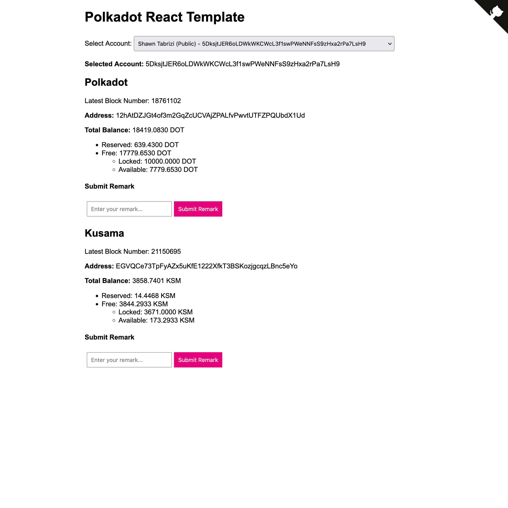

# Polkadot React Template

This is a minimal [React JS](https://react.dev/) template for Polkadot SDK Blockchains.



This project was bootstrapped with:

- [Create React App](https://github.com/facebook/create-react-app)
- [React GitHub Pages](https://github.com/gitname/react-gh-pages)
- [Polkadot JS](https://polkadot.js.org/)

This project is intended to be very minimal, easy to understand, and easy to hack on top of. For a slightly more robust implementation of react components, check out the [substrate-front-end-template](https://github.com/substrate-developer-hub/substrate-front-end-template).

## Available Scripts

In the project directory, you can run:

### `yarn start`

Runs the app in the development mode.

Open [http://localhost:3000](http://localhost:3000) to view it in your browser.

The page will reload when you make changes.

You may also see any lint errors in the console.

### `yarn deploy`

Builds the app and deploys it to GitHub pages.

To set up your project correctly for GitHub pages deployment, see [the instructions here](https://github.com/gitname/react-gh-pages).

## Components

This project comes with some minimal working components that you can copy or modify for your needs.

### `AccountContext``

The `AccountContext` component works with the Polkadot JS Extension to load all available accounts the user has imported.

You can access the user-selected account in your components by calling:

```js
import { useAccount } from './AccountContext';

const { selectedAccount } = useAccount();

console.log(selectedAccount.address);
```

You can submit transactions from this account by creating an `injector`:

```js
const injector = await web3FromAddress(selectedAccount.address);

await api.tx.system
  .remark('Hello, World!')
  .signAndSend(selectedAccount.address, { signer: injector.signer });
```

#### Props

- `appName`: A string which will appear when the user grants your application access to their Polkadot JS extension.

### `SubstrateContext`

The `SubstrateContext` gives you access to the Polkadot JS API in the context of a connected Substrate blockchain.

You can access the API with:

```js
import { useSubstrate } from './SubstrateContext';

const { api } = useSubstrate();

console.log(api.genesisHash.toHex());
```

#### Props

- `providerUrl`: A websocket URL to connect your application to the Substrate based blockchain. For example: `wss://rpc.polkadot.io`.

### Other Components

This template also comes with some other minimal components that take advantage of the `AccountContext` and `SubstrateContext`.

- `BlockNumber`: Subscribes to the current blocknumber of the connected blockchain.
- `AccountBalance`: Subscribes to the current balance of the selected account on the connected blockchain.
- `Remark`: Allows the selected account to submit a `remark` transaction using the Polkadot JS extension.

These components should provide the basic structure needed to build more complex and custom components.
